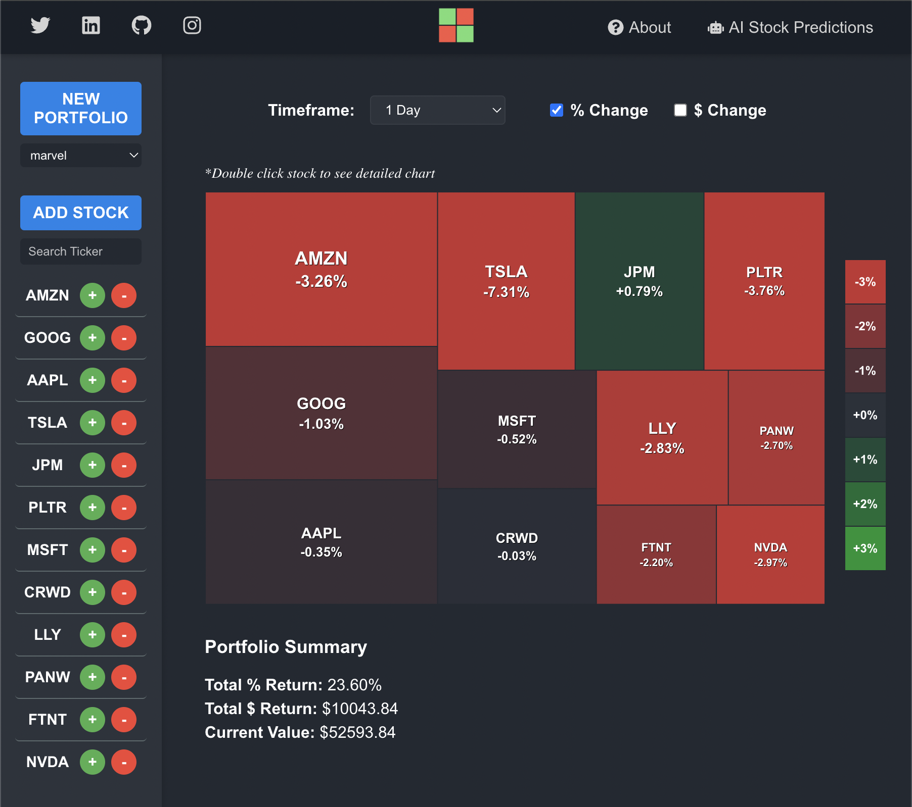
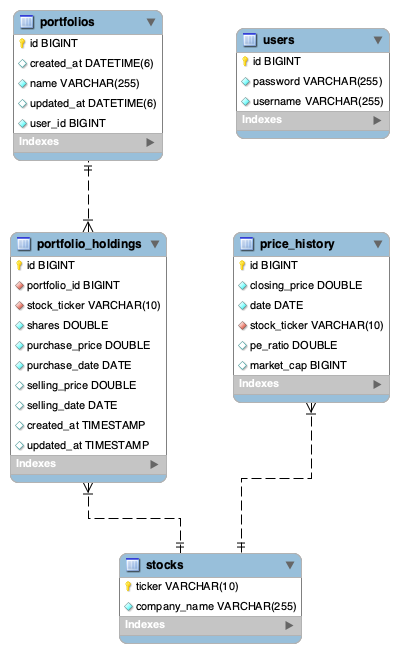

# ⭐ Portfolio Heatmap

A full-stack stock portfolio visualization application with a custom heatmap feature, built by a first-year computer science student to showcase professional-grade development skills.



## 📌 Project Overview
Portfolio Heatmap is a web application designed to help users manage and visualize their stock portfolios through an interactive heatmap, inspired by Finviz's S&P 500 heatmap. Unlike traditional heatmaps, this app focuses on user-defined portfolios or custom stock lists, with square sizes representing the percentage of the portfolio and colors indicating price performance (e.g., green for gains, red for losses).

This project is a work-in-progress full-stack application built to professional standards, demonstrating advanced skills in backend development (Spring Boot), database management (MySQL), API integration (FMP, Alpha Vantage), user authentication (Spring Security with JWT), and soon, front-end development (React) and cloud deployment (AWS). As a 19-year-old first-year computer science student, I'm using this project to challenge myself, learn advanced concepts, and create a portfolio piece that stands out for internship applications. The backend is now mostly complete, and I'm currently focusing on learning React to build a high-quality front end that matches the backend's capabilities.

---

## 🚀 Current Features
### 📊 Stock Management:
- CRUD operations for stocks (add, view, delete stocks).
- Populate stock data using Financial Modeling Prep (FMP) API.
- **Endpoints:**
  - `GET /stocks`
  - `GET /stocks/{id}`
  - `POST /stocks`
  - `POST /stocks/populate`
  - `DELETE /stocks/{id}`

### 📈 Stock Price Retrieval:
- Fetch real-time stock prices using Financial Modeling Prep (FMP) API (250 requests/day, free tier) with Alpha Vantage as a fallback (5/min, 25/day).
- **Endpoints:**
  - `GET /stocks/price/{symbol}`
  - `GET /stocks/batch-prices?symbols=AAPL,MSFT,TSLA`

### ⏳ Historical Price Updates:
- Update historical prices in the database for visualization and performance calculations.
- Populate historical price data for all stocks.
- **Endpoints:**
  - `PUT /stocks/{id}/update-price`
  - `POST /stocks/price-history/populate-all`

### 📅 Daily Price Updates:
- Automatically update the `price_history` table with the latest closing prices for all stocks every day at 6:00 PM EST (after market close).
- Uses batch requests to fetch prices efficiently within FMP's rate limits (300 requests/min, paid plan).
- Ensures historical data integrity with duplicate checks to prevent redundant entries.

### 📁 Portfolio Management:
- Full CRUD operations for portfolios: create, view, and delete portfolios for authenticated users.
- **Endpoints:**
  - `POST /portfolios/create?name=PortfolioName`
  - `GET /portfolios/user`
  - `GET /portfolios/{portfolioId}`
  - `DELETE /portfolios/{portfolioId}`

### 📊 Portfolio Holdings Management:
- Add, update, and delete stock holdings within a portfolio.
- Mark holdings as sold by adding a selling price and date.
- **Endpoints:**
  - `POST /portfolios/{portfolioId}/holdings/add?ticker=AAPL&shares=10&purchasePrice=150.25&purchaseDate=2024-06-15`
  - `PUT /portfolios/holdings/{holdingId}?shares=10&sellingPrice=225.50&sellingDate=2025-03-25`
  - `DELETE /portfolios/holdings/{holdingId}`

### 🔥 Portfolio Heatmap Visualization:
- Interactive heatmap displaying stocks from the user's portfolio.
- Square sizes based on the percentage of the portfolio (larger squares for higher allocation).
- Square colors based on price performance (green for gains, red for losses).
- Dynamic text sizing based on rectangle dimensions for better readability.
- Multiple timeframe options (1d, 1w, 1m, 3m, 6m, YTD, 1y, Total).

### 🎨 Modern User Interface:
- Responsive dark theme design across all components.
- Fixed header with social media links and navigation.
- Clean, intuitive portfolio and timeframe selection.
- Consistent styling across login, registration, and main application pages.

### 📈 Performance Metrics:
- Calculate key portfolio metrics: total portfolio value, total open/closed gains/losses, and percentage returns.
- Per-holding gains/losses and percentage returns for both open and closed positions.
- Uses historical price data to compute unrealized gains/losses for open positions.

### 🗄️ Database:
- MySQL database with tables for stocks, portfolios, holdings, users, and historical prices.
- Normalized schema with foreign key relationships (e.g., `portfolio_holdings` links to `portfolios` and `stocks`).



### 🏗 Backend Architecture:
- Spring Boot with a clean separation of concerns (controllers, services, repositories).
- Flexible stock data provider setup using a factory pattern (`StockDataServiceFactory`) to switch between FMP and Alpha Vantage.
- Resolved serialization issues (circular references, large responses) using Jackson annotations (`@JsonIdentityInfo`, `@JsonIgnore`).

### 🔐 User Authentication:
- Spring Security with JWT for user registration, login, and role-based access control.
- Secure endpoints to ensure users can only access their own portfolios.
- **Endpoints:**
  - `POST /auth/register`
  - `POST /auth/login`

---

## 🎯 Planned Features

### ☁️ AWS Deployment:
- Deploy the backend (Spring Boot) to AWS Elastic Beanstalk and the database to RDS.
- Deploy the React front end to AWS Amplify or S3+CloudFront.
- Set up a custom domain using Route 53 (e.g., `yourportfolioheatmap.com`).
- Enable HTTPS with AWS Certificate Manager.

### 🤖 Advanced AI Integration
- Predictive Analytics: Implement machine learning models to forecast stock price movements using historical data patterns and market indicators
- Sentiment Analysis: Analyze real-time news, social media, and financial reports to gauge market sentiment for portfolio holdings
- Portfolio Optimization: Develop AI-driven recommendations for portfolio rebalancing based on risk tolerance and market conditions
- Anomaly Detection: Use AI to identify unusual trading patterns and potential market opportunities
- Custom Alerts: Create intelligent alerting system that learns from user preferences and market behavior

### ⚡ Performance Optimizations:
- Implement Redis caching for frequently accessed data
- Optimize database queries with materialized views
- Set up CDN for static assets
- Implement WebSocket connections for real-time updates
- Add server-side pagination for large datasets
- Set up monitoring with AWS CloudWatch.

---

## 🛠️ Tech Stack
### 📌 Backend
- **Spring Boot**: REST API framework.
- **MySQL**: Relational database for storing stocks, portfolios, holdings, users, and historical prices.
- **Spring Data JPA**: For database interaction.
- **Financial Modeling Prep (FMP) API**: Primary stock data provider (250 requests/day, free tier).
- **Alpha Vantage API**: Fallback stock data provider (5/min, 25/day).
- **Spring Security**: For user authentication with JWT.
- **React**: Front-end framework for building the UI and heatmap.
- **D3.js**: For the portfolio heatmap visualization.

### 🔜 Planned
- **AWS**:
  - Elastic Beanstalk: Backend hosting.
  - RDS: MySQL database hosting.
  - Amplify/S3+CloudFront: Front-end hosting.
  - Route 53: Custom domain.
  - ElastiCache (Redis): Caching.

---

## ⚙️ Setup Instructions
### 🔹 Prerequisites
- Java 17+
- MySQL 8.0+
- Maven
- FMP API Key (sign up at [financialmodelingprep.com](https://financialmodelingprep.com))
- Alpha Vantage API Key (sign up at [alphavantage.co](https://www.alphavantage.co))

### 🔹 Installation
#### 1️⃣ Clone the Repository:
```bash
git clone https://github.com/Marvel1738/portfolio-heatmap.git
cd portfolio-heatmap
```

#### 2️⃣ Set Up MySQL:
```sql
CREATE DATABASE portfolio_heatmap;
```
The schema (stocks, portfolio, users, price_history) will be created automatically by Spring Data JPA (`spring.jpa.hibernate.ddl-auto=update`).

#### 3️⃣ Configure Application Properties:
Edit `src/main/resources/application.properties`:

#### 4️⃣ Run the Application:
```bash
mvn spring-boot:run
```
The app will start on `http://localhost:8080`.

#### 5️⃣ Test Endpoints:
Use Postman or curl to test:
Authenticate:
```bash
POST http://localhost:8080/auth/login
Body: {"username": "yourusername", "password": "yourpassword"}
```
Copy the JWT token from the response.

Test Enpoints (include Authorization: Bearer <token> in headers):
```bash
POST http://localhost:8080/portfolios/create?name=MyPortfolio
GET http://localhost:8080/portfolios/user
GET http://localhost:8080/portfolios/{portfolioId}
POST http://localhost:8080/portfolios/{portfolioId}/holdings/add?ticker=AAPL&shares=10&purchasePrice=150.25&purchaseDate=2024-06-15
GET http://localhost:8080/stocks/price/AAPL
GET http://localhost:8080/stocks/batch-prices?symbols=AAPL,MSFT,TSLA
```

---

## 🎯 Future Goals
- **Professional Portfolio:** Showcase this project to employers.
- **Potential Startup:** Monetization through subscriptions or ads.
- **Learning and Growth:** Advance skills in authentication, React, and AWS deployment.

---

## 🤝 Contributing
Contributions are welcome! If you'd like to contribute:
1. Fork the repository.
2. Create a new branch: `git checkout -b feature/your-feature`.
3. Commit your changes: `git commit -m 'Add your feature'`.
4. Push to the branch: `git push origin feature/your-feature`.
5. Open a pull request.

---

## 📜 License
This project is licensed under the MIT License. See the LICENSE file for details.

 - Author: [Marvel Bana] (19-year-old first-year computer science student)
 - Email: [marvelbana6@@gmail.com] 
 - GitHub: [https://github.com/Marvel1738]
 - LinkedIn: [https://www.linkedin.com/in/marvel-bana-7aa697317/]
